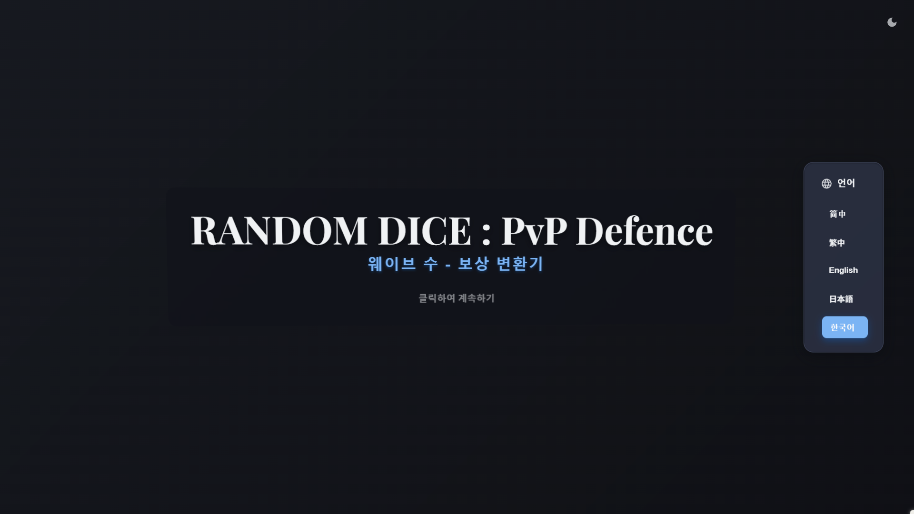
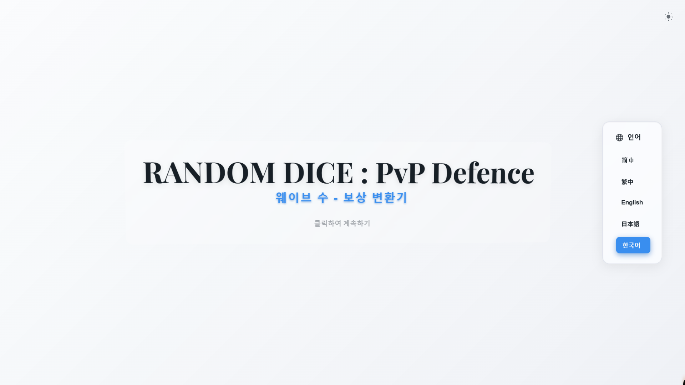

[繁體中文](README.zh-TW.md)　|　[简体中文](README.zh-CN.md)　|　[English](README.md)　|　[日本語](README.ja.md)　|　한국어

---
# 랜덤 다이스 협동전 보상 변환기

"랜덤 다이스: PvP 디펜스" 플레이어를 위해 설계된 고성능 웹 애플리케이션으로, 
편리한 협동 모드 산출물 변환 및 데이터 시각화 기능을 제공합니다.

---
## 주요 기능 (Features)

이 도구는 게임 내 각 웨이브 구간의 산출 규칙을 기반으로, 알고리즘을 통해 데이터의 양방향 변환 및 분석을 구현합니다.

#### **변환 모드**
* **웨이브 ❯ 카드**: 지정된 웨이브 수를 입력하면, 누적 공식 `C(W) = Σ c(w)`에 따라 해당 웨이브까지 획득할 수 있는 총 카드 수를 정확하게 계산합니다.
* **카드 ❯ 웨이브**: 목표 카드 수를 입력하면, 이진 탐색 알고리즘(Binary Search)을 사용하여 해당 목표를 달성하는 데 필요한 최소 웨이브 수를 효율적으로 역산합니다.
* **재화 ❯ 웨이브**: 골드 또는 다이아몬드 수량을 입력하면, 해당하는 카드 수와 동일한 가치의 웨이브 수로 변환합니다.

#### **고급 기능 및 상호작용**
* **결과 상호작용**:
    * **구간 계산**: 결과 창에서 한 항목을 다른 항목으로 드래그하여 두 항목 간의 차이를 빠르게 계산할 수 있습니다.
    * **보상 상세 정보**: 카드 수를 클릭하면 클래스에 따라 해당하는 카드 상자에서 얻을 수 있는 일반, 희귀, 영웅, 전설 주사위의 기대값과 골드, 다이아몬드 수량을 즉시 변환하여 표시합니다.
    * **다중 선택 복사**: 여러 결과 항목을 한 번에 복사할 수 있습니다.
* **데이터 시각화 차트**:
    * 웨이브 수와 카드 수의 비선형적 성장 관계를 시각화하는 인터랙티브 차트를 제공합니다.
* **기타 기능**:
    * **기록**: 최근 검색 기록을 자동으로 임시 저장합니다.
    * **자주 쓰는 표**: 자주 참조되는 값에 대한 빠른 참조 표가 내장되어 있습니다.

---
## 기술 스택 (Tech Stack)

* **프론트엔드**: `HTML5`, `CSS3`, `JavaScript (ES6+)`
* **차트**: `Chart.js`
* **애니메이션**: `GSAP (GreenSock Animation Platform)`

---
Developed by Estrella-071